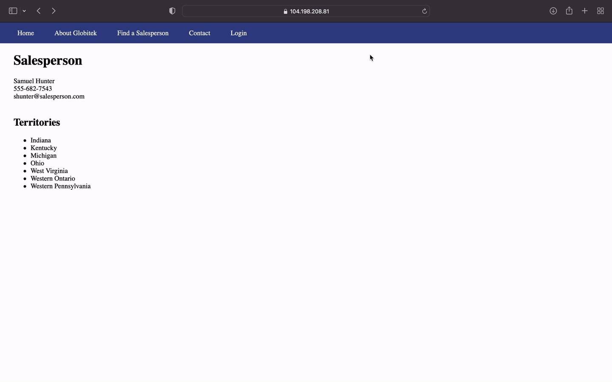

# Pen Testing Live Targets

Time spent: 3 hours spent in total

> Objective: Identify vulnerabilities in three different versions of the Globitek website: blue, green, and red.

The six possible exploits are:

* Username Enumeration
* Insecure Direct Object Reference (IDOR)
* SQL Injection (SQLi)
* Cross-Site Scripting (XSS)
* Cross-Site Request Forgery (CSRF)
* Session Hijacking/Fixation

Each color is vulnerable to only 2 of the 6 possible exploits. First discover which color has the specific vulnerability, then write a short description of how to exploit it, and finally demonstrate it using screenshots compiled into a GIF.

## Blue

Vulnerability #1: SQL Injection 

Description: Under the salesperson information page, the user can perform an attack by adding a SQL injection to the end of the URL. As shown in the walkthrough, when adding ' OR SLEEP(5)=0--' to the end of the URL, the website shows a different staff member's profile, indicating that it responded to the SQL that was added. The mistake the developer made was not sanitizing the URL input.

## Green

Vulnerability #1: User Enumeration 

Description: This vulnerability is on the Login page for the green website. The mistake the developer made was assigning a different class to failed login attempt message for valid usernames and invalid usernames. As shown in the walkthrough, attempting to login with the invalid username 'zyx' results in a 'Log in was unsuccessful' message that is bolded, under the class 'failed'. On the other hand, attempting to login with the valid username 'jmonroe99' with the incorrect password results in the same message unbolded, under the class 'failure'. An attacker can use this vulnerability to enumerate through usernames to figure out which are valid. 

## Red

Vulnerability #1: Indirect Object Reference 

Description: Under staff information, each staff member's profile is identified by their ID, which is visible in the URL. In the red page, the user can simply change the ID to that of any person who is in the salesperson, even those who are not supposed to be visible (such as Lazy Lazyman who was fired). While the other versions of the site redirect the user to the salesperson directory when changing the ID to that of a salesperson who is not listed on the public site, the red version still shows the non-public salesperson's profile. In the walkthrough, this is demonstrated by changing the ID to that of Lazy Lazyman (11).

